<!-- Self-hosted so the design matches vedantmane.vercel.app, with no dependency
     on a third-party widget service staying up or under its rate limit. Alt
     text on these is deliberately descriptive: image alt is one of the few
     things on a GitHub profile that search engines actually index. -->

# Vedant Mane

## Data Engineer and AI Developer, Boston, MA

[Portfolio](https://vedantmane.vercel.app) &nbsp;·&nbsp; [LinkedIn](https://www.linkedin.com/in/vedant-mane/) &nbsp;·&nbsp; [Email](mailto:vedant12mane@gmail.com)

I build data platforms and the AI systems that run on top of them: batch and streaming ETL pipelines,
dimensional data warehouses on **Databricks** and **Snowflake**, and agentic AI with **LangGraph** and
**RAG**. Three years of production data engineering at **Tata Consultancy Services**, now finishing an
**MS in Information Systems at Northeastern University** in Boston.

Open to **Data Engineer**, **Analytics Engineer**, **Machine Learning Engineer** and **AI Engineer**
roles in the United States or remote.

---

## At a glance

---

## What I work on

**Data engineering.** Batch and streaming pipelines on Databricks and Snowflake, orchestrated with
Apache Airflow, Azure Data Factory and dbt. Delta Live Tables, Auto Loader and Unity Catalog for
ingestion that survives schema drift, with data quality checks that quarantine bad rows rather than
dropping them.

**Dimensional warehousing.** Star schemas, slowly changing dimensions, surrogate keys and conformed
dimensions, built so a fact table and its dimensions agree by construction instead of by a
reconciliation query afterwards.

**Machine learning and reinforcement learning.** PyTorch and TensorFlow, parameter-efficient
fine-tuning with LoRA and PEFT, and reinforcement learning with PPO, deep Q-networks and Thompson
sampling.

**Agentic AI and retrieval.** LangGraph and CrewAI agent systems, retrieval-augmented generation over
vector stores including Pinecone and ChromaDB, document extraction with Mistral OCR and Docling, and
Model Context Protocol integrations.

**Cloud and delivery.** AWS, Azure and Google Cloud, containerised with Docker and Kubernetes, served
through FastAPI and Streamlit.

---

## Technical stack

---

Pinned repositories below are a slice of the work. The <a href="https://vedantmane.vercel.app">portfolio</a> has the rest, each with an architecture diagram and the reasoning behind the build. Charts rebuild daily from the GitHub API.
