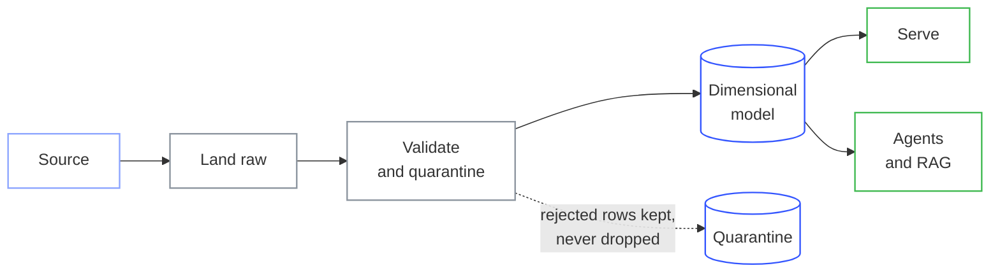

<!-- Self-hosted, so it matches vedantmane.vercel.app and does not depend on a
     third-party widget service staying up or under its rate limit. -->

I build data platforms and the AI systems that sit on top of them. Batch and streaming pipelines,
dimensional warehousing on Databricks and Snowflake, and agentic systems with LangGraph and RAG.

Currently finishing an **MS in Information Systems at Northeastern University**, after three years
building production data systems at **Tata Consultancy Services**.

**[Portfolio, with architecture write-ups →](https://vedantmane.vercel.app)**

---

---

### How I work

- **The number has to be checkable.** If I quote a figure, it traces to a committed file rather than an estimate.
- **Failure modes over happy paths.** Schema drift, unmatched joins and re-runnable loads are what decide whether a pipeline survives contact with real data.
- **Read the code, not the README.** Documentation drifts from behaviour faster than anyone expects, including my own.
- **Cost is a design constraint.** Warehouse spend and GPU memory belong in the design, not in the invoice you read later.

---

### How I tend to build things

The branch to quarantine is the part that matters. A row that fails validation gets written somewhere
countable rather than silently dropped, which is the difference between a pipeline you can trust and
one whose totals merely look plausible.

---

### Stack

**Data** &nbsp;

**AI** &nbsp;

**Cloud** &nbsp;

---

### Reach me

Pinned repositories below are a slice of the work. The portfolio has the rest, with architecture diagrams and the reasoning behind each build.
