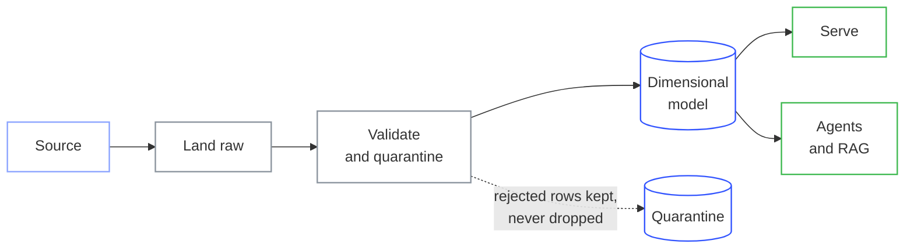

<!-- Self-hosted, so it matches vedantmane.vercel.app and does not depend on a
     third-party widget service staying up or under its rate limit. -->

I build data platforms and the AI systems that sit on top of them. Batch and streaming pipelines,
dimensional warehouses on Databricks and Snowflake, and agentic systems with LangGraph and RAG.

Currently finishing an **MS in Information Systems at Northeastern University**, after three years
building production data systems at **Tata Consultancy Services**.

**[See the full portfolio →](https://vedantmane.vercel.app)** &nbsp;·&nbsp; every project there has an
architecture write-up and the decisions behind it.

---

### What I actually care about

- **The number has to be checkable.** Every figure below traces back to a committed file, not an estimate.
- **Failure modes over happy paths.** Schema drift, unmatched joins, and re-runnable loads decide whether a pipeline survives contact with real data.
- **Read the code, not the README.** Several of the repos below describe things their own code does not do.

---

### Selected work

| Project | What it does | Measured |
| :--- | :--- | :--- |
| **[SEC Financial Data Engineering](https://vedantmane.vercel.app/projects/sec-financial-pipeline)** | Three parallel DAGs and dbt over SEC filings | 50M+ values, **0** quality failures across 30M+ rows, **81%** cost reduction |
| **[IMDb Entertainment Analytics](https://vedantmane.vercel.app/projects/imdb-analytics)** | Databricks DQX and DLT with bridge tables | **98M+** records, 24 tables, full run in **1m 48s** |
| **[Multi-Agentic Startup Intelligence](https://vedantmane.vercel.app/projects/venture-scope)** | Four independent agent loops over five scheduled DAGs | MCP integrated **two weeks** after the protocol went public |
| **[Mental Wellness Companion](https://vedantmane.vercel.app/projects/mental-wellness-rl)** | PPO and Thompson sampling, trained on generated personas | **0** safety violations across 476 episodes |
| **[NVIDIA Financial Report RAG](https://vedantmane.vercel.app/projects/nvidia-fin-rag)** | Chunking strategy treated as an experiment | **8,307** vectors, 1,847 pages, 85–92% retrieval relevance |
| **[Deep Q-Learning on Atari Kaboom](https://vedantmane.vercel.app/projects/atari-kaboom-dqn)** | Baseline measured first, one variable per run | **214%** over random, every run committed as JSON |

Ten more at **[vedantmane.vercel.app](https://vedantmane.vercel.app/#projects)**, including Azure Data Factory to Snowflake, LoRA fine-tuning, and an Oracle platform with access control in the database.

---

---

### How I tend to build things

GitHub renders this natively, so it stays readable in both light and dark:

The branch to quarantine is the part that matters. A row that fails validation is written somewhere
countable rather than silently dropped, which is the difference between a pipeline you can trust and
one whose totals merely look plausible.

---

### Stack

**Data** &nbsp;

**AI** &nbsp;

**Cloud** &nbsp;

---

### Reach me

